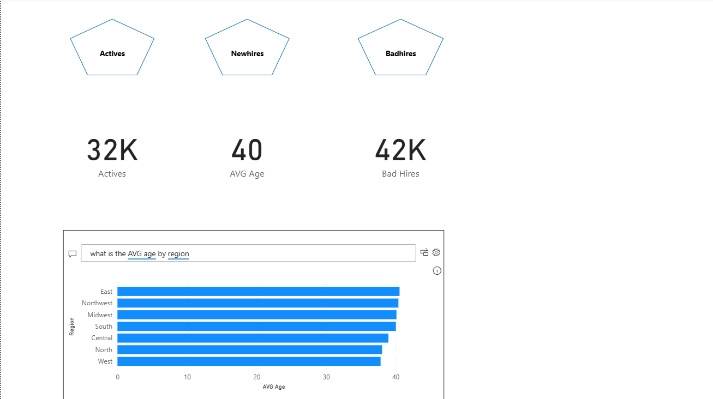
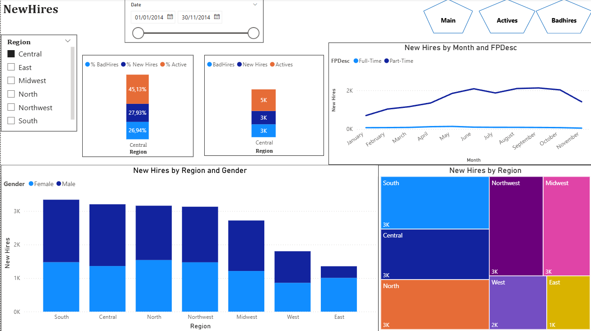
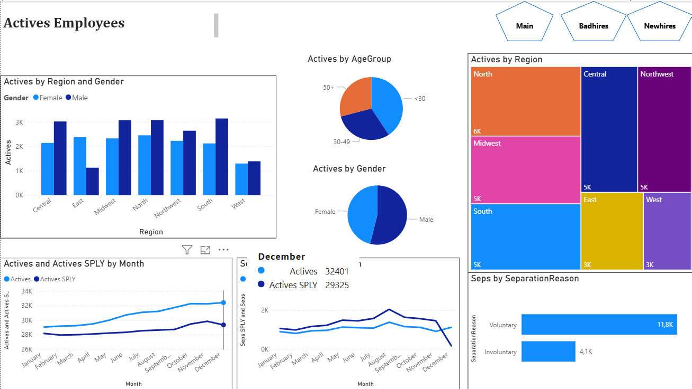
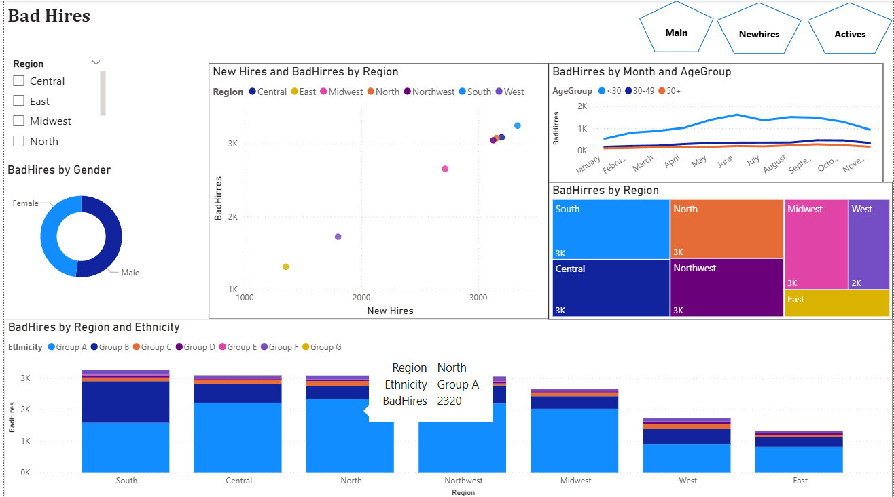

# HR Workforce Analytics Dashboard | Python & Power BI

An end-to-end HR analytics project that demonstrates the complete data analysis workflow, from data cleaning and preprocessing with Python to building an interactive multi-page Power BI dashboard for workforce analysis and business decision support.

---

# 📌 Project Overview

This project analyzes employee workforce data to uncover insights into hiring quality, workforce composition, employee retention, and demographic trends.

The workflow includes:

- Data cleaning and preprocessing using Python
- Data transformation with Power Query
- KPI development using DAX
- Interactive dashboard design in Power BI
- Business-oriented workforce analysis

> **Note**
>
> The dataset used in this project is mock data created for learning and portfolio purposes only. It does not represent any real company.

---

# 🎯 Objectives

The dashboard was designed to answer business questions such as:

- How is the workforce distributed across different regions?
- Which regions generate the highest number of bad hires?
- How have active employees changed over time?
- What are the demographic characteristics of the workforce?
- What are the major employee separation reasons?
- Which recruitment channels or regions require attention?

---

# 🛠 Tech Stack

### Programming

- Python
    - Pandas
    - NumPy

### Business Intelligence

- Power BI
- Power Query
- DAX

### Data Source

- Microsoft Excel

---

# ⚙ Data Preparation

Before building the dashboard, the dataset was cleaned and standardized using Python.

The preprocessing workflow included:

- Handling missing values
- Removing duplicate records
- Standardizing inconsistent categorical values
- Fixing incorrect data types
- Cleaning date columns
- Preparing data for Power BI import

---

# 📊 Dashboard Features

The Power BI report consists of **4 interactive pages** connected through navigation buttons and slicers.

## 1️⃣ Executive Overview



### Key KPIs

- 32K Active Employees
- 40 Average Employee Age
- 42K Bad Hires

### Highlights

- Executive KPI summary
- AI-powered Q&A visual
- Average employee age by region
- Navigation across report pages

---

## 2️⃣ New Hires Analysis



### Analysis includes

- Monthly hiring trends
- Full-Time vs Part-Time hiring
- Regional hiring distribution
- Gender distribution
- Bad Hire ratio by region
- Regional comparison using Treemap

Business value:

Identify recruitment performance across regions and detect potential hiring issues.

---

## 3️⃣ Active Employees Analysis



### Analysis includes

- Workforce distribution by region
- Employee age groups
- Gender distribution
- Monthly workforce trend
- Previous-year workforce comparison
- Employee separation reasons

Business value:

Monitor workforce stability and identify demographic trends.

---

## 4️⃣ Bad Hires Analysis



### Analysis includes

- Bad Hires by region
- Bad Hires vs New Hires comparison
- Monthly Bad Hire trend
- Age group analysis
- Ethnicity distribution
- Gender analysis

Business value:

Help HR identify recruitment bottlenecks and improve hiring quality.

---

# 📈 Key Skills Demonstrated

- Data Cleaning
- Data Transformation
- Exploratory Data Analysis (EDA)
- KPI Development
- DAX Measures
- Power Query
- Dashboard Design
- Business Intelligence
- HR Analytics
- Interactive Reporting
- Data Storytelling

---

# 📁 Project Structure

```text
HR Workforce Analytics/
│
├── data/
│   ├── Data.xlsx
│   └── Data_Cleaned_Final.xlsx
│
├── notebooks/
│   └── HR_Data_Cleaning.ipynb
│
├── powerbi/
│   └── HR_Analytics.pbix
│
├── images/
│   ├── dashboard.png
│   ├── newhires.png
│   ├── actives.png
│   └── badhires.png
│
├── README.md
├── requirements.txt
└── .gitignore
```

---

# 🚀 Future Improvements

Potential enhancements for future versions include:

- SQL database integration
- Automated ETL pipeline
- HR forecasting using Machine Learning
- Employee turnover prediction
- Department-level drill-through analysis
- Performance KPI forecasting